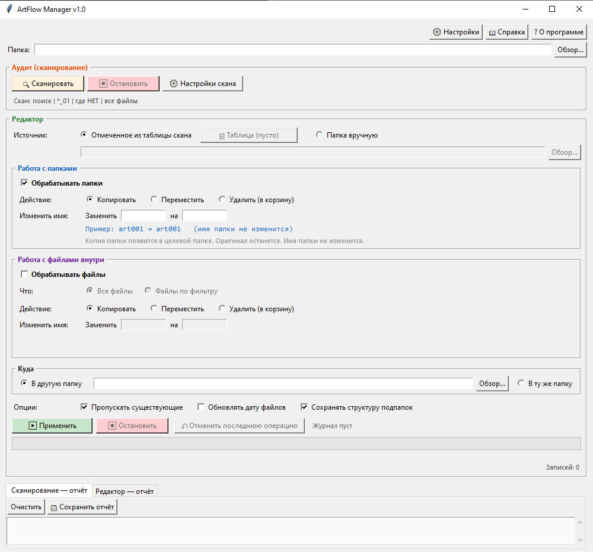

# ArtFlow Manager

**Массовая обработка папок и файлов по списку артикулов.**

[](https://www.python.org/)
[](LICENSE)
[]()

---

## О программе

ArtFlow Manager — настольное приложение для Windows, которое помогает навести порядок в больших коллекциях файлов, названных по номерам артикулов. Основные задачи:

- Найти все папки определённого вида (например, где есть `*_pr`, но нет `*_01`).
- Сверить содержимое с внешним списком артикулов.
- Массово переименовать, скопировать, переместить или удалить в Корзину — как папки целиком, так и отдельные файлы внутри.
- При ошибке — откатить последнюю операцию.

---

## Скриншот



---

## Возможности

- **Сканирование** по маскам: `*_01`, `*_pr`, `*.psd`, `abc*`, `*test*`.
- **Сравнение шаблонов**: «есть один, нет второго».
- **Фильтр по списку артикулов** — поддержка `.txt`, `.csv`, `.xlsx`, `.docx`.
- **Работа с папками и файлами** — отдельно или одновременно.
- **Переименование** — замена подстрок (все вхождения), добавление префикса/суффикса, удаление подстрок.
- **Действия**: копировать / переместить / удалить в корзину.
- **Фильтры файлов**: по расширению, маске, размеру, датам создания и изменения.
- **Многопоточная обработка** (опционально).
- **Журнал и откат** последней операции.
- **Всплывающие подсказки** (можно отключить).
- **Встроенная справка** — подробное руководство прямо в программе.

---

## Установка

### Требования

- Windows 10/11
- Python 3.8 или новее

### Установка зависимостей

```bash
pip install send2trash openpyxl python-docx
```

### Запуск

```bash
python ArtFlow_Manager.py
```

---

## Использование

1. **Выберите папку** — корень для сканирования.
2. **Настройте скан** — маска, расширения, при необходимости — сравнение или список артикулов.
3. **Нажмите «Сканировать»** — программа найдёт подходящие папки.
4. **Откройте таблицу** — отметьте нужные записи.
5. **Настройте редактор** — действие, куда, переименование.
6. **Нажмите «Применить»**.
7. **При необходимости — «Отменить последнюю операцию»**.

Подробное руководство доступно прямо в программе через кнопку **📖 Справка**.

---

## Зависимости

| Библиотека | Назначение | Обязательно |
|---|---|---|
| `send2trash` | Удаление в Корзину Windows | Нет (без неё — `os.remove`) |
| `openpyxl` | Чтение `.xlsx` со списками артикулов | Нет |
| `python-docx` | Чтение `.docx` со списками артикулов | Нет |

Все зависимости **опциональны**: программа запустится и без них, просто соответствующий функционал будет отключён.

---

## Файлы, создаваемые программой

Рядом с исполняемым файлом (или скриптом) программа создаёт два файла:

- `settings.json` — настройки пользователя.
- `last_operation.json` — журнал последней операции для отката.

Эти файлы **не хранятся в репозитории** (см. `.gitignore`).

---

## Лицензия

Распространяется под лицензией MIT. См. файл [LICENSE](LICENSE).

---

## Автор

**NikiFils** — © 2026